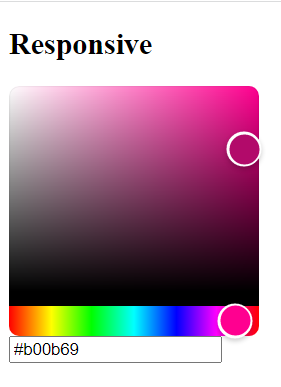

# React Konva

React Konva is a JavaScript library for drawing complex canvas graphics using [React](https://reactjs.org/)

It provides declarative and reactive bindings to the [Konva Framework](https://konvajs.org/).

# picture Demo

**How to draw fill part on top of the stroke ?**
**Instructions: Take a look into two examples of different fill&stroke order.**
